# 前言
本解析基于CSDN博主：[锡城筱凯](https://blog.csdn.net/xiaokai1999 "锡城筱凯")的Webots_demo进行使用解析，仅供学习使用。
# 一键安装&&配置环境变量
```shell
wget http://fishros.com/install -O fishros && . fishros
```
- 选择noetic版本然后傻瓜式安装
- 配置环境变量 [升级！！Ubuntu20.04 noetic\_webots2021aubuntu-CSDN博客](https://blog.csdn.net/xiaokai1999/article/details/113938950) 看第2大点，加上那句话
	export WEBOTS_HOME=/usr/local/webots/

---
# 安装Webots
[Releases · cyberbotics/webots](https://github.com/cyberbotics/webots/releases)
选择2021a的版本
``` shell
sudo dpkg -i webots_2021a_amd64.deb
```
应该会有报错，有报错就看下面的链接，执行给出的命令就可以了
[修复Webots在ubuntu下安装出现的一些依赖问题\_webots 依赖于 ffmpeg;然而: 未安装软件包 ffmpeg。-CSDN博客](https://blog.csdn.net/weixin_43687617/article/details/118674809)

---
# 安装git
``` shell
sudo apt-get install git
```

---
# 导入工作空间文件&&导入额外的配置文件
创建文件catkin_ws和catkin_ws/src（src为catkin_ws的子文件）
进入到src文件打开终端输入
``` shell
git clone https://github.com/cyberbotics/webots_ros.git
```
这里再附上一些需要安装的包
``` shell
sudo apt install ros-noetic-gmapping
```

``` shell
sudo apt-get install ros-noetic-amcl
```

``` shell
sudo apt install ros-noetic-map-server
```

``` shell
sudo apt install ros-noetic-move-base
```

``` shell
sudo apt install ros-noetic-teb-local-planner
```

**后面就请仔细阅读**[GitHub - JackyMao1999/webots\_demo: ROS联合webots实战案例](https://github.com/JackyMao1999/webots_demo)
**认真阅读文档内容**后执行操作方法的（2. 命令行进入`catkin_ws/src`）以后的就内容好

执行
``` shell
catkin_make
```
的时候是终端定位在catkin_ws文件夹

---
# 启动
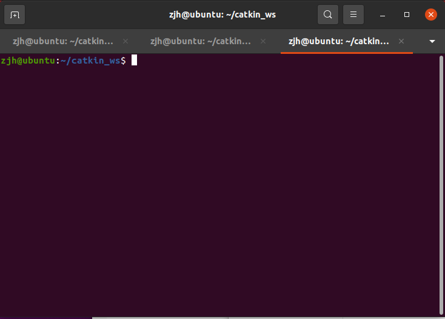

打开三个终端
每个终端都要先执行一句
``` shell
source ./devel/setup.bash
```
然后随便一个终端执行
``` shell
roscore
```

另外两个就执行
``` shell
roslaunch webots_demo amcl_demo.launch
```

``` shell
rosrun  webots_demo demo_2dnav_move
```

意思就是
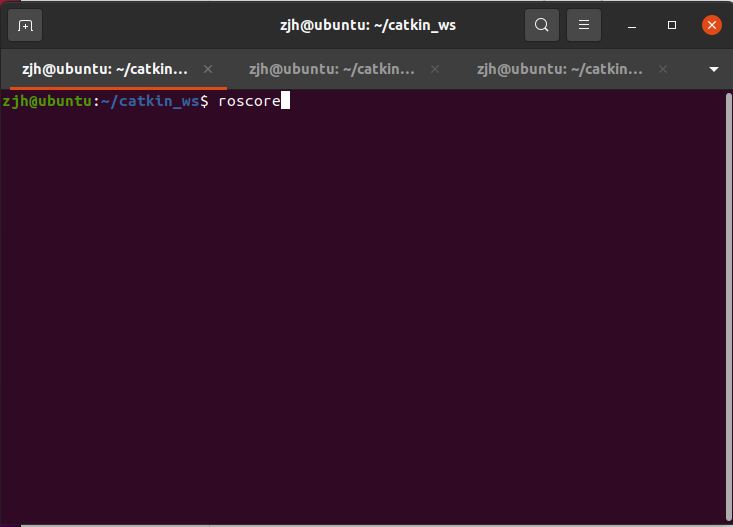
这里的source ./devel/setup.bash可以省略
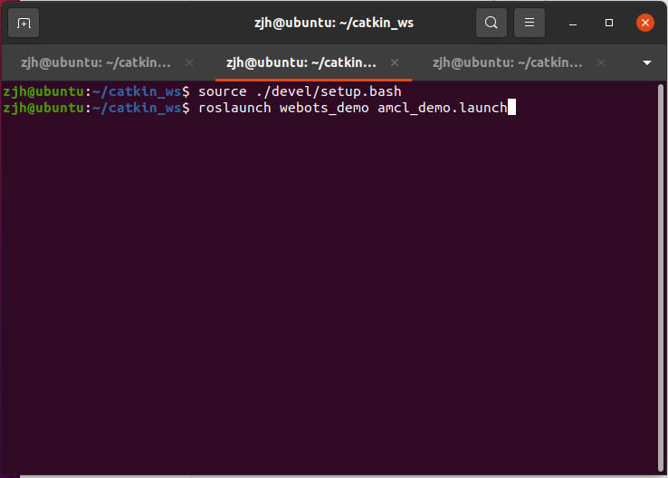
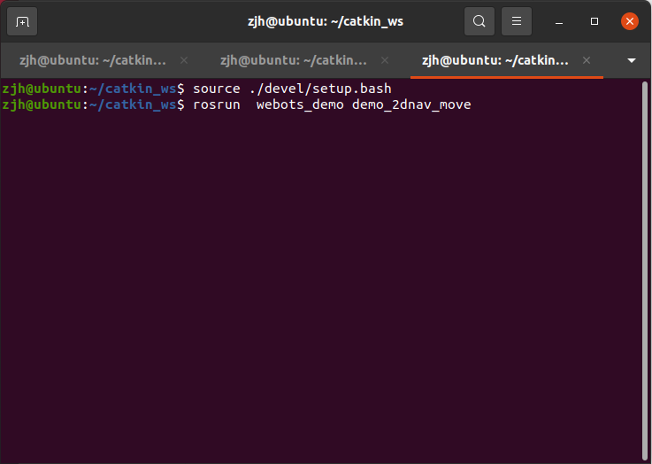

就能启动了
后续的扫图操作其实也差不多的

---
# 扫图
具体建图就不说什么了，这里我们选用slam_teb_gmapping算法来扫图，这个算法坏处就是第一次扫图很容易歪，扫完一次保存后在扫一次效果就好很多了（可能会根据之前的保存的来在进行扫描），另外一个算法比较麻烦这里就没有有给出，有多余的时间自己再探索吧

一下介绍扫图的流程
## 前置工作
1. 先建好地图
2. 将地图放在worlds文件夹下
	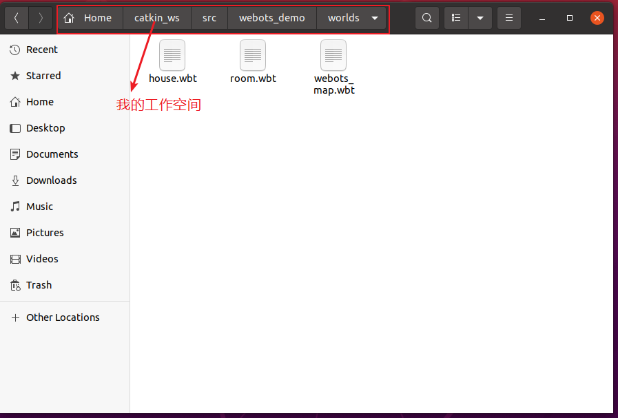
	我的地图名字叫room.wbt，你们命名随意记住啥名字就好
3. 更换webots打开的默认地图
	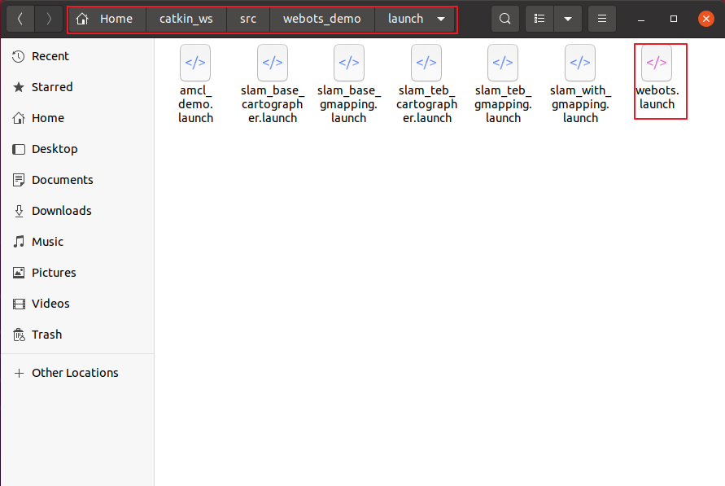打开launch文件夹下的webots.launch文件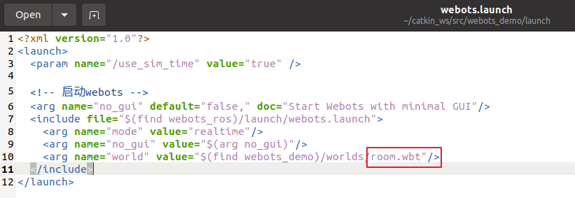这里就替换你的地图文件名就好

## 开始扫图
跟前面的启动差不多，我在这里再重复一遍吧
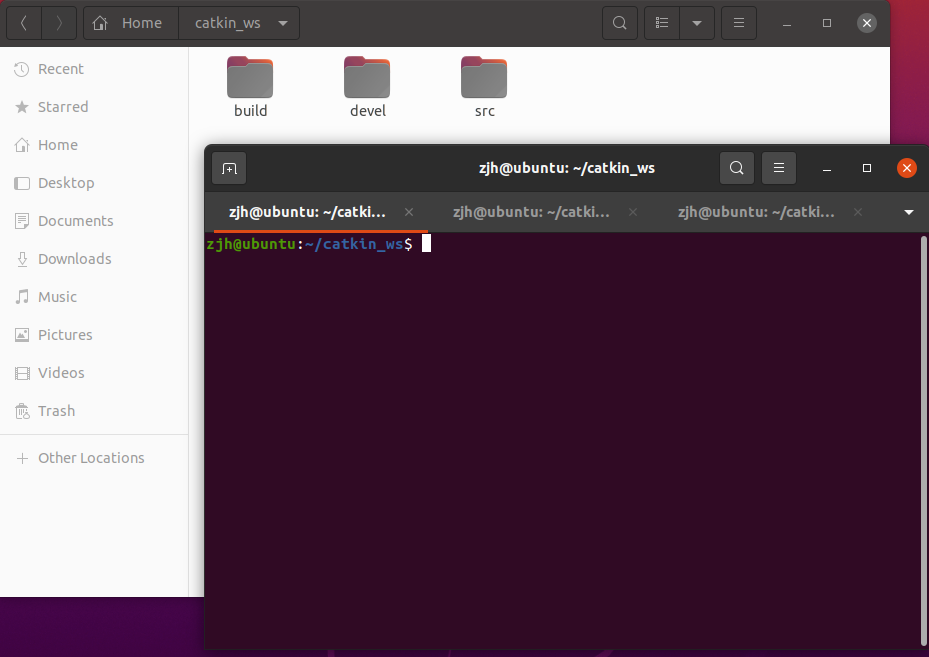

在工作空间下开三个终端，三个终端分别输入
第一个
``` shell
roscore
```
第二个
``` shell
source ./devel/setup.bash
roslaunch webots_demo slam_base_gmapping.launch
```
第三个
``` shell
source ./devel/setup.bash
rosrun  webots_demo velocity_keyboard_v2
```

输入完第二个的时候就可以看到一下效果
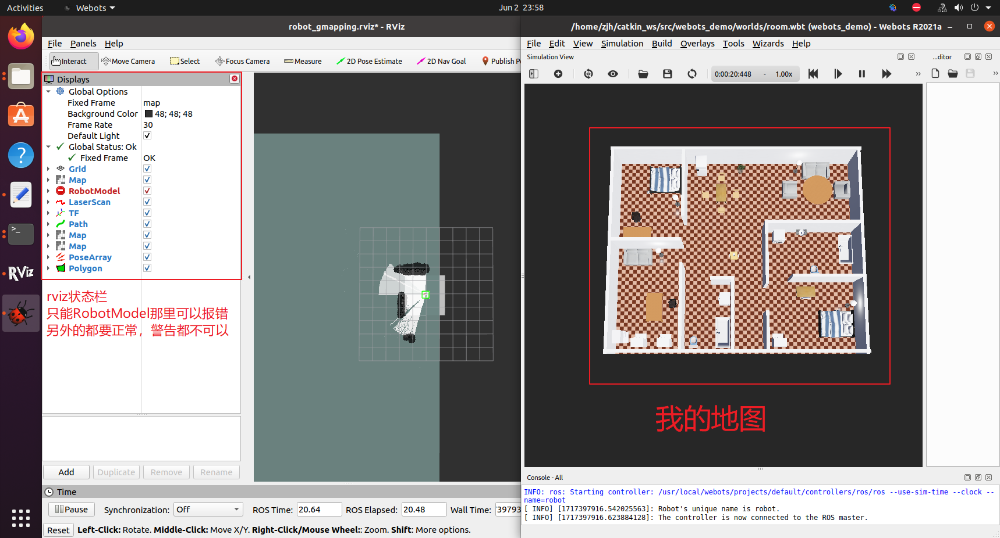
输入完第三个


就可以通过键盘方向键来控制机器人的移动

**特别注意：
机器人的前方为蓝色轴的反方向
你也可以通过在webots中拉动方向轴来实现机器人的移动和旋转来扫图，但不要太快**

## 完成扫图后的保存
在工作空间中打开终端
执行
``` shell
cd src/webots_demo/config/
rosrun map_server map_saver -f map
```
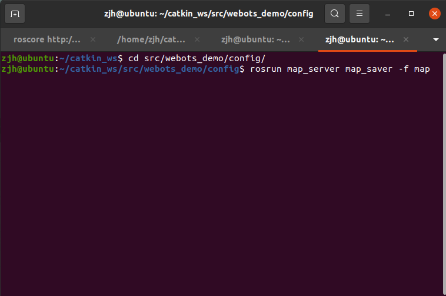

这样就能保存扫过的地图了
推荐再重复一次从开始扫图那里的步骤，会更加精准，一下是我扫完地图后的文件

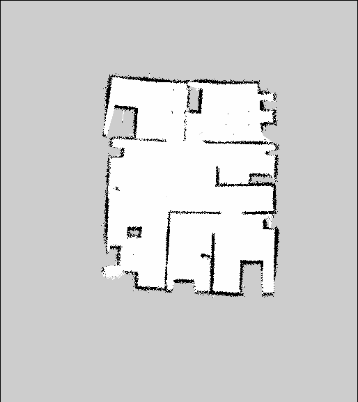

**特别注意：保存完地图的时候，一定要记得保存webots场景，他可能会提醒你要覆盖掉原来的场景，那就覆盖掉，因为保存的时候rviz也会保存机器人在rviz的坐标，如果不保存webots场景，那么webots和rviz的机器人的坐标会不一致（虽然扫图的时候看起来不一样），反正就是扫图结束以后就记得webots保存就好！！！**

## 启动观看成果

1. 先点绿色的让它周围的红色箭头集中
2. 就点紫色的他就能自动到那个地方了
3. 导航到自己想到的地方后，一切都成功了
# 结束